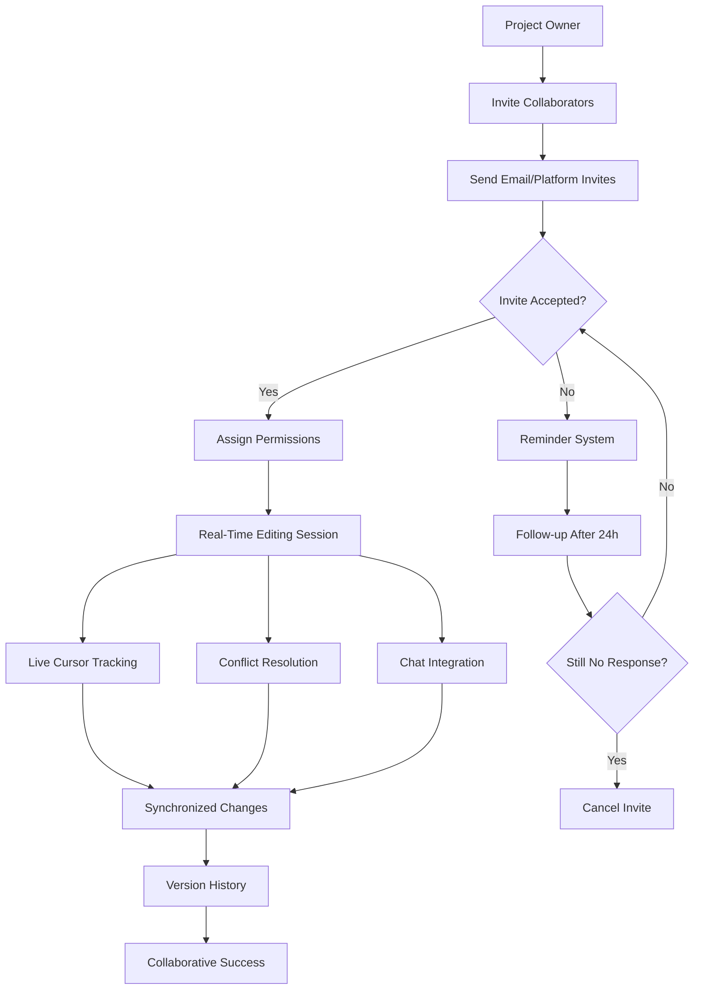
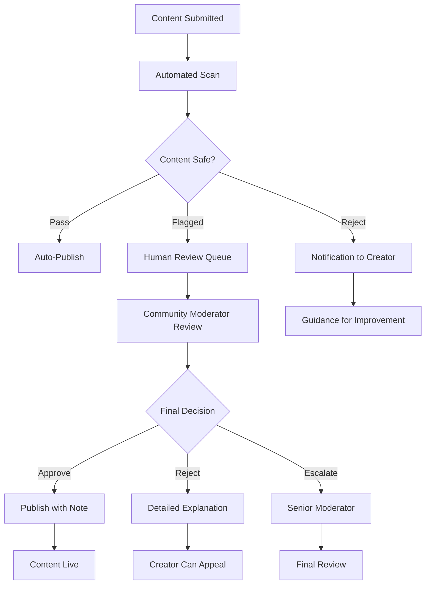
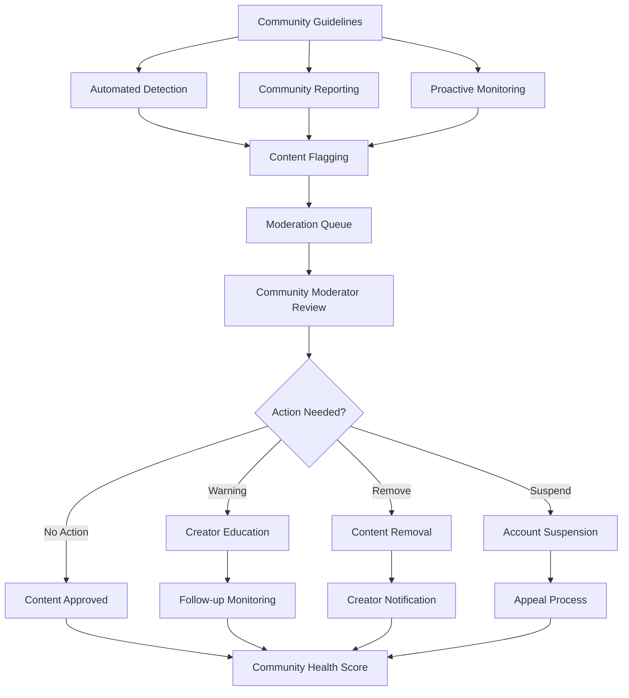

# Community Features: Building GameGen's Creative Ecosystem

## Community Vision

GameGen's community is designed to be a supportive, inspiring environment where creators of all skill levels can share, learn, collaborate, and grow together. The community features foster both individual creativity and collective innovation while maintaining safety and inclusivity.

## Core Community Features

### 1. Game Gallery & Discovery System

#### Public Game Showcase
A curated space where users can discover and play community-created games.

```
Game Gallery Interface:
┌─────────────────────────────────────────────────────────┐
│ 🎮 Community Games                          [🔍][⚙️]   │
│                                                         │
│ Featured Today • Staff Picks • Trending • New          │
│                                                         │
│ ┌─────────────┐ ┌─────────────┐ ┌─────────────┐       │
│ │┌───────────┐│ │┌───────────┐│ │┌───────────┐│       │
│ ││[Preview]  ││ ││[Preview]  ││ ││[Preview]  ││       │
│ │└───────────┘│ │└───────────┘│ │└───────────┘│       │
│ │Crystal Quest │ │Math Raiders │ │Space Cat    │       │
│ │by @sarah_dev │ │by @teacher_m│ │by @pixel_pro│       │
│ │⭐ 4.8 (156) │ │⭐ 4.9 (89)  │ │⭐ 4.7 (234) │       │
│ │🎮 2.1K plays│ │🎮 1.3K plays│ │🎮 3.2K plays│       │
│ │[▶ Play]     │ │[▶ Play]     │ │[▶ Play]     │       │
│ │[❤️ 89] [🔗] │ │[❤️ 67] [🔗] │ │[❤️ 142][🔗]│       │
│ └─────────────┘ └─────────────┘ └─────────────┘       │
└─────────────────────────────────────────────────────────┘
```

#### Advanced Discovery Features
- **Algorithm-Based Recommendations**: Personalized suggestions based on play history, likes, and creator following
- **Trending Detection**: Real-time identification of viral games using engagement velocity
- **Category Filtering**: Genre, difficulty, art style, and educational content filters
- **Search with Natural Language**: "Find puzzle games for kids" or "Show me pixel art RPGs"
- **Creator Spotlights**: Weekly featured creator profiles and interviews

#### Game Metadata & Tagging System
```
Game Information Panel:
┌─────────────────────────────────────────────────────────┐
│ 🎮 Crystal Quest Adventure                              │
│ by Sarah Johnson (@sarah_dev) • Created 3 days ago     │
│                                                         │
│ 📊 2,156 plays • ⭐ 4.8/5.0 (127 ratings) • ❤️ 89     │
│ ⏱️ Average play time: 4 minutes                        │
│                                                         │
│ 🏷️ Tags: platformer • pixel-art • adventure • beginner│
│ 🎓 Educational: problem-solving • spatial-reasoning    │
│ 📱 Mobile-friendly • 🌍 All ages                       │
│                                                         │
│ "Guide a brave explorer through mysterious crystal     │
│  caves, collecting gems and avoiding ancient traps!"   │
│                                                         │
│ [▶️ Play Now] [❤️ Like] [💾 Save] [🔗 Share] [🚩 Report]│
│ [🎨 View Assets] [👤 Follow Creator] [🔄 Remix]        │
└─────────────────────────────────────────────────────────┘
```

### 2. User Profiles & Portfolio System

#### Creator Profile Design
```
User Profile Layout:
┌─────────────────────────────────────────────────────────┐
│ ┌────────┐ Sarah Johnson                                │
│ │[Avatar]│ @sarah_dev • Joined March 2024              │
│ │        │ 🏆 Featured Creator • ⭐ 4.7 avg rating     │
│ └────────┘                                              │
│                                                         │
│ "Pixel art enthusiast creating games that spark        │
│  imagination and wonder! 🎨✨"                          │
│                                                         │
│ 🎮 12 Games • 👥 1.2K Followers • 👤 Following 156    │
│ 📊 25K Total Plays • 🏅 15 Community Awards            │
│                                                         │
│ ┌─────────────────────────────────────────────────────┐ │
│ │ Recent Games                      [View All Games]  │ │
│ │ ┌─────────┐ ┌─────────┐ ┌─────────┐ ┌─────────┐   │ │
│ │ │[Game 1] │ │[Game 2] │ │[Game 3] │ │[Game 4] │   │ │
│ │ │156 plays│ │234 plays│ │89 plays │ │312 plays│   │ │
│ │ └─────────┘ └─────────┘ └─────────┘ └─────────┘   │ │
│ └─────────────────────────────────────────────────────┘ │
│                                                         │
│ [👤 Follow] [💬 Message] [🔔 Notifications]           │
└─────────────────────────────────────────────────────────┘
```

#### Portfolio Customization
- **Showcase Selection**: Pin favorite games to profile top
- **Achievement Display**: Community awards, milestones, and badges  
- **Bio & Links**: Personal description, social media, website links
- **Creation Statistics**: Detailed analytics for creators
- **Collaboration History**: Teams worked with and joint projects

### 3. Social Interaction System

#### Like & Reaction System
```
Game Interaction Bar:
┌─────────────────────────────────────────────────────────┐
│ ❤️ 89  😍 12  🤯 23  🔥 31  👏 15        💬 Comments   │
│                                                         │
│ Quick reactions show immediate feedback to creators     │
│                                                         │
│ ❤️ Love it   😍 Amazing   🤯 Mind-blown   🔥 So cool   │
│ 👏 Well done   🎯 Perfect   🧠 Clever   ⭐ Favorite    │
└─────────────────────────────────────────────────────────┘
```

#### Comment & Feedback System
```
Comment Thread:
┌─────────────────────────────────────────────────────────┐
│ 💬 Comments (23)                         [Sort: Recent▼]│
│                                                         │
│ ┌───────────────────────────────────────────────────────┐│
│ │ @mike_creator • 2 hours ago               [Reply] [❤] ││
│ │ This is exactly the kind of puzzle game I want to    ││
│ │ learn how to make! The progression feels perfect.    ││
│ │ ❤️ 5 replies                                          ││
│ └───────────────────────────────────────────────────────┘│
│                                                         │
│ ┌───────────────────────────────────────────────────────┐│
│ │ @teacher_lisa • 4 hours ago               [Reply] [❤] ││
│ │ My students would love this! Mind if I show it       ││
│ │ as an example in tomorrow's class?                   ││
│ │ ❤️ 2  💬 3 replies                                   ││
│ └───────────────────────────────────────────────────────┘│
│                                                         │
│ ┌─────────────────────────────────────────────────────┐ │
│ │ Add a comment...                           [Post]   │ │
│ └─────────────────────────────────────────────────────┘ │
└─────────────────────────────────────────────────────────┘
```

#### Following & Feed System
```
Personal Activity Feed:
┌─────────────────────────────────────────────────────────┐
│ 📱 Your Feed                              [Customize]   │
│                                                         │
│ ┌───────────────────────────────────────────────────────┐│
│ │ 🎮 @sarah_dev published "Mystic Maze"                ││
│ │ 2 hours ago • 🏷️ puzzle, adventure                   ││
│ │ [▶️ Play] [❤️ Like] [💬 Comment]                      ││
│ └───────────────────────────────────────────────────────┘│
│                                                         │
│ ┌───────────────────────────────────────────────────────┐│
│ │ 👤 @alex_student started following you               ││
│ │ 3 hours ago • [View Profile] [Follow Back]           ││
│ └───────────────────────────────────────────────────────┘│
│                                                         │
│ ┌───────────────────────────────────────────────────────┐│
│ │ 🏆 Your game "Space Explorer" was featured!          ││
│ │ 5 hours ago • Staff Pick by GameGen Team             ││
│ │ [View Feature] [Share Achievement]                   ││
│ └───────────────────────────────────────────────────────┘│
└─────────────────────────────────────────────────────────┘
```

### 4. Collaboration Tools

#### Real-Time Collaborative Editing


#### Project Sharing & Permissions
```
Collaboration Settings:
┌─────────────────────────────────────────────────────────┐
│ 👥 Collaboration Settings for "Crystal Quest"          │
│                                                         │
│ Project Visibility:                                     │
│ ◉ Private (Only collaborators can see)                 │
│ ○ Unlisted (Anyone with link can view)                 │
│ ○ Public (Discoverable by everyone)                    │
│                                                         │
│ Current Collaborators:                                  │
│ ┌───────────────────────────────────────────────────────┐│
│ │ 👤 @sarah_dev (you) • Owner • Full Access           ││
│ │ 👤 @mike_artist • Editor • Can edit all assets      ││
│ │ 👤 @alex_sounds • Contributor • Audio only          ││
│ │ 👤 @teacher_lisa • Viewer • Can view & comment      ││
│ └───────────────────────────────────────────────────────┘│
│                                                         │
│ [+ Add Collaborator] [📧 Manage Invites]               │
│                                                         │
│ Permission Levels:                                      │
│ • Owner: Full control, can delete project              │
│ • Editor: Can modify all game elements                 │
│ • Contributor: Limited to specific areas               │
│ • Viewer: Read-only access with commenting             │
└─────────────────────────────────────────────────────────┘
```

#### Team Communication
```
Integrated Chat System:
┌─────────────────────────────────────────────────────────┐
│ 💬 Project Chat: Crystal Quest                         │
│                                                         │
│ @sarah_dev: Just updated the jump mechanics            │
│ 10:23 AM                                               │
│                                                         │
│ @mike_artist: Looks great! Should I add more           │
│ background details to level 3?                         │
│ 10:25 AM                                               │
│                                                         │
│ @alex_sounds: Working on victory sound - want          │
│ something magical! 🎵                                  │
│ 10:28 AM                                               │
│                                                         │
│ @sarah_dev: @mike_artist yes please! And               │
│ @alex_sounds that sounds perfect                       │
│ 10:30 AM                                               │
│                                                         │
│ ┌─────────────────────────────────────────────────────┐ │
│ │ Type a message...                        [Send]    │ │
│ │ [@] [📁] [🎮] [😀]                                  │ │
│ └─────────────────────────────────────────────────────┘ │
└─────────────────────────────────────────────────────────┘
```

### 5. Community Forums & Discussion

#### Forum Structure
```
GameGen Community Forums:
┌─────────────────────────────────────────────────────────┐
│ 🏠 Home    📚 Tutorials    💡 Ideas    🔧 Help    🎉 Show & Tell│
│                                                         │
│ 📌 Pinned Posts                                         │
│ • Welcome to GameGen Community! (Read this first)      │
│ • Community Guidelines & Code of Conduct               │
│ • Monthly Challenge: Retro Arcade Games                │
│                                                         │
│ 🔥 Hot Topics                                          │
│ ┌───────────────────────────────────────────────────────┐│
│ │ 💭 "Best practices for AI art generation"            ││
│ │ by @design_guru • 47 replies • 2 hours ago          ││
│ │ 🏷️ tips, ai-art, design                             ││
│ └───────────────────────────────────────────────────────┘│
│                                                         │
│ ┌───────────────────────────────────────────────────────┐│
│ │ 🎮 "Share your first game! New creator support"      ││
│ │ by @community_mod • 156 replies • 4 hours ago       ││
│ │ 🏷️ beginners, feedback, support                     ││
│ └───────────────────────────────────────────────────────┘│
│                                                         │
│ [📝 Start New Discussion]                              │
└─────────────────────────────────────────────────────────┘
```

#### Topic Categories
- **🎓 Learning Hub**: Tutorials, tips, educational content
- **💡 Ideas & Inspiration**: Game concepts, creative challenges
- **🔧 Technical Help**: Troubleshooting, how-to questions
- **🎉 Showcase**: Show off games, get feedback
- **👥 Collaboration**: Find teammates, joint projects
- **📢 Announcements**: Official updates, features, events
- **🌍 Regional**: Location-based communities and meetups

### 6. Gamification & Recognition

#### Achievement System
```
User Achievement Profile:
┌─────────────────────────────────────────────────────────┐
│ 🏆 Your Achievements                              15/50  │
│                                                         │
│ Recently Earned:                                        │
│ ┌───────────────────────────────────────────────────────┐│
│ │ 🎮 First Game Creator                                ││
│ │ Created and published your first game                ││
│ │ Earned 2 days ago                                    ││
│ └───────────────────────────────────────────────────────┘│
│                                                         │
│ ┌───────────────────────────────────────────────────────┐│
│ │ ❤️ Community Loved (100 likes)                       ││
│ │ Your games received 100+ total likes                 ││
│ │ Earned yesterday                                      ││
│ └───────────────────────────────────────────────────────┘│
│                                                         │
│ Next Goals:                                             │
│ • 🌟 Rising Star (1,000 total plays) - 756/1,000      │
│ • 🎨 Art Master (10 games with custom assets) - 3/10  │
│ • 👥 Team Player (5 collaborative projects) - 1/5     │
│                                                         │
│ [View All Achievements]                                 │
└─────────────────────────────────────────────────────────┘
```

#### Badge & Milestone System
```
Badge Categories:

Creator Badges:
🎮 First Game, 🌟 Rising Star, 🏆 Featured Creator,
🎨 Art Master, 🔧 Code Wizard, 📚 Tutorial Creator

Community Badges:
❤️ Community Loved, 👥 Team Player, 🤝 Mentor,
💬 Discussion Leader, 🌍 Global Collaborator

Special Badges:
🚀 Early Adopter, 🏅 Challenge Winner, 👑 Hall of Fame,
🎯 Contest Judge, 📈 Trending Creator
```

#### Leaderboards & Recognition
```
Community Leaderboards:
┌─────────────────────────────────────────────────────────┐
│ 📊 This Week's Top Creators                            │
│                                                         │
│ 🥇 @sarah_dev          2,156 plays • 3 new games      │
│ 🥈 @pixel_master       1,843 plays • 89 likes         │
│ 🥉 @teacher_mike       1,672 plays • 5 collaborations  │
│ 4️⃣ @creative_alex      1,445 plays • 2 featured       │
│ 5️⃣ @game_guru         1,234 plays • 67 helpful posts  │
│                                                         │
│ 🎯 Special Recognition:                                │
│ 👑 Most Helpful: @community_helper                     │
│ 🌟 Best Newcomer: @first_timer_jane                   │
│ 🎨 Art Excellence: @visual_artist_pro                  │
│                                                         │
│ [View Full Rankings] [Nomination Form]                 │
└─────────────────────────────────────────────────────────┘
```

### 7. Events & Challenges

#### Monthly Creative Challenges
```
Current Challenge:
┌─────────────────────────────────────────────────────────┐
│ 🏆 November Challenge: "Retro Arcade Revival"          │
│                                                         │
│ Create a game inspired by classic 80s arcade games!    │
│ Think Pac-Man, Space Invaders, Frogger, etc.          │
│                                                         │
│ ⏰ Time Remaining: 12 days, 4 hours                    │
│ 👥 Participants: 234 creators                          │
│ 🎮 Submissions: 89 games                               │
│                                                         │
│ Prizes:                                                 │
│ 🥇 1st Place: $500 + GameGen Max (1 year)             │
│ 🥈 2nd Place: $250 + GameGen Pro (6 months)           │
│ 🥉 3rd Place: $100 + GameGen Pro (3 months)           │
│ 🏅 Top 10: Featured on homepage + special badge       │
│                                                         │
│ [Join Challenge] [View Submissions] [Rules & Judging] │
└─────────────────────────────────────────────────────────┘
```

#### Community Events Calendar
```
Upcoming Events:
┌─────────────────────────────────────────────────────────┐
│ 📅 Community Calendar                                   │
│                                                         │
│ Dec 5 • 🎓 Educator Workshop: "Games in STEM Class"   │
│ Dec 12 • 👥 Collaboration Mixer: Find Your Team        │
│ Dec 19 • 🎮 Community Game Jam (48 hours)             │
│ Dec 25 • 🎄 Holiday Showcase: Share Festive Games     │
│ Jan 2 • 🚀 New Year Resolutions: Learning Goals       │
│                                                         │
│ [Add to Calendar] [Get Notifications] [Suggest Event] │
└─────────────────────────────────────────────────────────┘
```

### 8. Content Curation & Moderation

#### Community Guidelines
```
GameGen Community Standards:
┌─────────────────────────────────────────────────────────┐
│ 🤝 Our Community Values                                │
│                                                         │
│ ✅ Be Kind & Supportive                               │
│ • Encourage creativity and learning                     │
│ • Provide constructive feedback                        │
│ • Celebrate others' successes                          │
│                                                         │
│ ✅ Create Original Content                             │
│ • Share your own games and ideas                       │
│ • Credit inspirations and remixes                      │
│ • Respect intellectual property                        │
│                                                         │
│ ✅ Keep It Appropriate                                 │
│ • Content suitable for all ages                        │
│ • No violence, hate, or offensive material             │
│ • Educational and creative focus                       │
│                                                         │
│ [Read Full Guidelines] [Report Content] [Appeal Process]│
└─────────────────────────────────────────────────────────┘
```

#### Automated Content Filtering


#### Community Reporting System
```
Report Content Interface:
┌─────────────────────────────────────────────────────────┐
│ 🚩 Report This Content                                 │
│                                                         │
│ Why are you reporting "Space Adventure Game"?          │
│                                                         │
│ ○ Inappropriate content                                 │
│ ○ Spam or misleading                                   │
│ ○ Copyright infringement                               │
│ ○ Harassment or bullying                               │
│ ○ Technical issues/broken                              │
│ ○ Other (please specify)                               │
│                                                         │
│ ┌─────────────────────────────────────────────────────┐ │
│ │ Additional details (optional):                      │ │
│ │ This game contains content that seems copied from   │ │
│ │ another creator without permission...               │ │
│ └─────────────────────────────────────────────────────┘ │
│                                                         │
│ [Submit Report] [Cancel]                               │
│                                                         │
│ Reports are reviewed within 24 hours. Thank you for   │
│ helping keep our community safe and creative! 🛡️       │
└─────────────────────────────────────────────────────────┘
```

### 9. Creator Support & Growth

#### Mentorship Program
```
Find a Mentor/Become a Mentor:
┌─────────────────────────────────────────────────────────┐
│ 🎓 GameGen Mentorship Program                          │
│                                                         │
│ Connect with experienced creators for guidance and      │
│ growth, or share your expertise with newcomers!        │
│                                                         │
│ For New Creators:                                       │
│ • Get personalized guidance on game design             │
│ • Learn advanced techniques from pros                  │
│ • Build confidence through supportive feedback         │
│                                                         │
│ For Experienced Creators:                              │
│ • Share your knowledge and experience                   │
│ • Build leadership in the community                    │
│ • Earn special mentor badges and recognition           │
│                                                         │
│ Current Mentors Available: 23                          │
│ Students Seeking Mentors: 67                           │
│                                                         │
│ [Find a Mentor] [Become a Mentor] [Learn More]        │
└─────────────────────────────────────────────────────────┘
```

#### Creator Analytics Dashboard
```
Creator Insights:
┌─────────────────────────────────────────────────────────┐
│ 📊 Your Creator Dashboard                              │
│                                                         │
│ This Month:                                            │
│ 🎮 Total Plays: 1,247 (+23% vs last month)           │
│ ❤️ New Likes: 89 (+45% vs last month)                │
│ 👥 New Followers: 12 (+8% vs last month)             │
│ 💬 Comments: 34 (+67% vs last month)                 │
│                                                         │
│ Top Performing Games:                                   │
│ 1. "Crystal Quest" - 456 plays, 4.8★ rating          │
│ 2. "Math Adventure" - 334 plays, 4.9★ rating         │
│ 3. "Space Cat" - 287 plays, 4.7★ rating              │
│                                                         │
│ Growth Opportunities:                                   │
│ • Try creating educational content (trending +34%)     │
│ • Consider collaborating (increases reach by 2.3x)     │
│ • Engage more in forums (active creators get +50% visibility)│
│                                                         │
│ [Detailed Analytics] [Growth Tips] [Success Stories]   │
└─────────────────────────────────────────────────────────┘
```

## Community Success Metrics

### Engagement Metrics
```
Community Health KPIs:
┌─────────────────────────────────────────────────────────┐
│ Monthly Active Users (MAU): Target 25K by Year 1       │
│ Daily Active Users (DAU): Target 5K by Year 1          │
│ User-Generated Content: Target 10K games by Year 1     │
│ Community Interactions: Target 100K monthly actions    │
│                                                         │
│ Creator Retention: Target 60% month-over-month         │
│ Cross-Creator Collaboration: Target 15% of creators    │
│ Mentorship Participation: Target 5% of active users    │
│ Forum Engagement: Target 30% of users participate      │
└─────────────────────────────────────────────────────────┘
```

### Quality Metrics
```
Content Quality Indicators:
• Average Game Rating: Target >4.5 stars
• Completion Rate: Target >70% of games played to end
• Share Rate: Target 25% of games shared externally
• Remix Rate: Target 10% of games inspire remixes
• Educational Usage: Target 20% of content used in schools
```

## Platform Safety & Trust

### Trust & Safety Framework


### Age-Appropriate Content
- **Content Rating System**: G (General), E (Educational), T (Teen guidance suggested)
- **Parental Controls**: Account restrictions for users under 13
- **Educational Focus**: Priority given to learning-oriented content
- **Regular Audits**: Monthly review of flagged content and community reports

This comprehensive community feature set creates a thriving, supportive ecosystem where creators can learn, grow, collaborate, and inspire each other while maintaining safety and quality standards appropriate for all ages.