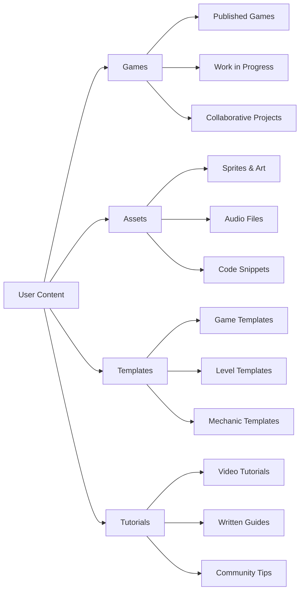
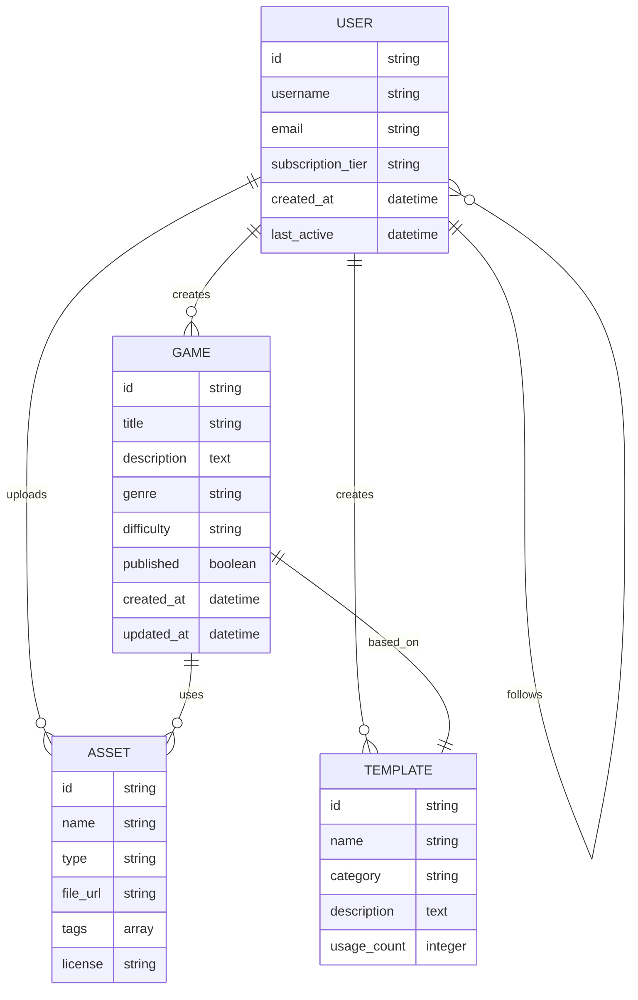
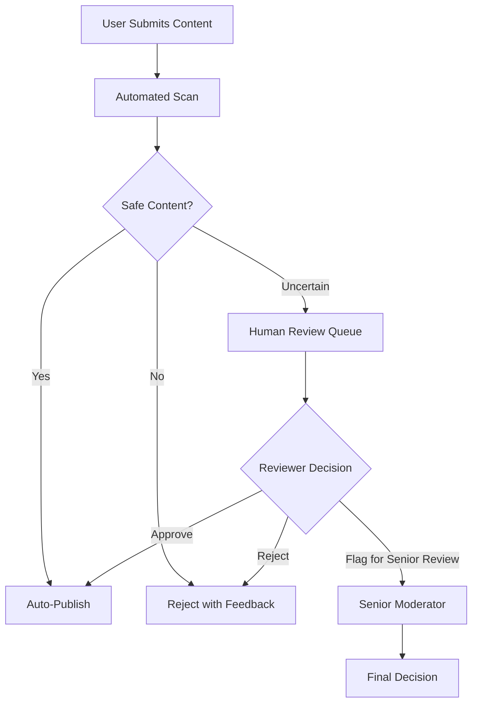

# Information Architecture: GameGen Platform Structure

## Site Map & Navigation Hierarchy

```mermaid
graph TD
    A[GameGen.com] --> B[Public Pages]
    A --> C[User Dashboard]
    A --> D[Game Creator]
    A --> E[Community Hub]
    A --> F[Marketplace]
    A --> G[Support & Learning]
    
    B --> B1[Landing Page]
    B --> B2[Explore Games]
    B --> B3[Pricing]
    B --> B4[About]
    B --> B5[Blog]
    B --> B6[Login/Signup]
    
    C --> C1[My Games]
    C --> C2[Analytics]
    C --> C3[Account Settings]
    C --> C4[Billing]
    C --> C5[API Keys]
    
    D --> D1[Natural Language Creator]
    D --> D2[Visual Game Editor]
    D --> D3[Code Editor]
    D --> D4[Asset Library]
    D --> D5[Collaboration Tools]
    
    E --> E1[Game Gallery]
    E --> E2[User Profiles]
    E --> E3[Forums]
    E --> E4[Featured Content]
    E --> E5[Challenges & Events]
    
    F --> F1[Templates]
    F2[Assets]
    F --> F3[Plugins]
    F --> F4[Creator Store]
    F --> F5[Educational Packs]
    
    G --> G1[Documentation]
    G --> G2[Tutorials]
    G --> G3[Community Guides]
    G --> G4[Help Center]
    G --> G5[Contact Support]
```



## Primary Navigation Structure

### Header Navigation (Always Visible)
```
[GameGen Logo] | Create | Explore | Marketplace | Learn | [User Menu] | [Upgrade]
```

### User Menu Dropdown
```
- Dashboard
- My Games  
- Account Settings
- Billing & Usage
- Help & Support
- Sign Out
```

### Mobile Navigation
```
[☰ Menu] GameGen [User Avatar]

Expandable Menu:
- Create Game
- My Games  
- Explore
- Marketplace
- Learn
- Settings
```

## Page-Level Information Architecture

### Landing Page Structure
```
1. Hero Section
   - Value proposition
   - Interactive demo
   - "Start Creating" CTA
   
2. How It Works
   - 3-step process visualization
   - Example transformations
   
3. User Stories
   - Persona-based success stories
   - Video testimonials
   
4. Feature Highlights
   - AI-powered creation
   - Asset generation
   - Community features
   
5. Pricing Preview
   - Free tier highlights
   - "See All Plans" link
   
6. Footer
   - Secondary navigation
   - Social links
   - Legal pages
```

### Game Creator Interface Architecture
```
┌─────────────┬──────────────────────────────────┬─────────────┐
│    CHAT     │             MAIN EDITOR           │   ASSETS    │
│   PANEL     │                                   │   PANEL     │
│             │  ┌─ Play Mode Tab ────────────┐   │             │
│ - Natural   │  │                            │   │ - Generated │
│   Language  │  │    [Game Preview]          │   │   Assets    │
│   Interface │  │                            │   │ - Asset     │
│             │  └────────────────────────────┘   │   Library   │
│ - Quick     │                                   │ - Search &  │
│   Actions   │  ┌─ Visual Editor Tab ─────────┐  │   Filter    │
│             │  │                            │   │             │
│ - Context   │  │    [Scene Builder]         │   │ - Import    │
│   Help      │  │                            │   │   Tools     │
│             │  └────────────────────────────┘   │             │
│ - Project   │                                   │ - Tags &    │
│   History   │  ┌─ Code Editor Tab ──────────┐   │   Categories│
│             │  │                            │   │             │
│ - AI        │  │    [JavaScript Editor]     │   │             │
│   Settings  │  │                            │   │             │
│             │  └────────────────────────────┘   │             │
└─────────────┴──────────────────────────────────┴─────────────┘
```

### User Dashboard Layout
```
Top Bar: [Breadcrumbs] [Search] [Notifications] [User Menu]

Left Sidebar:
- Overview
- My Games
- Shared with Me  
- Templates
- Analytics
- Settings

Main Content Area:
- Quick Stats Cards
- Recent Games Grid
- Activity Feed
- Recommended Actions
```

## Content Classification System

### Game Content Taxonomy
```
Primary Categories:
├── Genre
│   ├── Action (Platformer, Shooter, Fighting)
│   ├── Puzzle (Logic, Match-3, Physics)
│   ├── Adventure (Story, Exploration, RPG)
│   ├── Strategy (Tower Defense, RTS, Turn-based)
│   └── Casual (Arcade, Idle, Social)
│
├── Complexity Level  
│   ├── Beginner (Single screen, simple mechanics)
│   ├── Intermediate (Multiple levels, basic AI)
│   └── Advanced (Complex systems, multiplayer)
│
├── Art Style
│   ├── Pixel Art (8-bit, 16-bit, Modern Pixel)
│   ├── Vector (Minimalist, Geometric, Cartoon)
│   └── Generated (AI-created, Style Transfer)
│
└── Educational Focus
    ├── Programming Concepts
    ├── Game Design Principles  
    ├── Subject Integration (Math, Science, History)
    └── Soft Skills (Creativity, Collaboration)
```

### Asset Organization System
```
Asset Library Structure:
├── Characters
│   ├── Player Characters
│   ├── NPCs
│   ├── Enemies
│   └── Animations
│
├── Environments
│   ├── Backgrounds  
│   ├── Tiles & Platforms
│   ├── Props & Decorations
│   └── UI Elements
│
├── Audio
│   ├── Music (Background, Victory, Game Over)
│   ├── Sound Effects (Actions, Ambient, UI)
│   └── Voice (Narration, Character Speech)
│
└── Code Components
    ├── Game Mechanics
    ├── UI Systems
    ├── Utility Functions
    └── Templates
```

## User-Generated Content Architecture

### Community Content Structure


### Content Discovery Mechanisms

#### For Games
- **Trending**: Based on plays, shares, likes in last 7 days
- **New & Noteworthy**: Recently published, quality-filtered
- **Staff Picks**: Curated by GameGen team
- **Similar Games**: Based on tags, mechanics, art style
- **Following**: Games from users you follow

#### For Educational Content  
- **By Skill Level**: Beginner → Intermediate → Advanced progression
- **By Learning Path**: Structured curriculum sequences
- **By Project Type**: Platformer tutorials, RPG guides, etc.
- **Community Contributed**: User-generated learning content

## Search & Filtering System

### Advanced Search Interface
```
Search Bar: [Query] [🔍]

Filters Panel:
┌─ Content Type ─────┐
│ ☑ Games           │
│ ☐ Templates       │  
│ ☐ Assets          │
│ ☐ Tutorials       │
└───────────────────┘

┌─ Difficulty ───────┐
│ ○ Beginner        │
│ ○ Intermediate    │
│ ○ Advanced        │
│ ○ Any             │
└───────────────────┘

┌─ Genre ────────────┐
│ ☐ Action          │
│ ☐ Puzzle          │
│ ☐ Adventure       │
│ ☐ Strategy        │
└───────────────────┘

┌─ Features ─────────┐
│ ☐ Multiplayer     │
│ ☐ Mobile-friendly │
│ ☐ Educational     │
│ ☐ Open Source     │
└───────────────────┘
```

### Search Result Presentation
```
┌─────────────────────────────────────────────────┐
│ [Thumbnail] Game Title                          │
│             by Username • 2 days ago           │
│             ⭐ 4.8 (24 reviews) 🎮 156 plays   │
│             Tags: platformer, pixel-art        │
│             "Short description of the game..." │
│             [▶ Play] [💾 Save] [🔗 Share]     │
└─────────────────────────────────────────────────┘
```

## Data Relationships & Connections

### User Data Model


## Mobile-First Responsive Architecture

### Breakpoint Strategy
- **Mobile**: 320px - 768px (Primary focus)
- **Tablet**: 768px - 1024px (Adapted experience)  
- **Desktop**: 1024px+ (Full feature set)

### Mobile Navigation Patterns
```
Mobile Game Creator Interface:

┌─────────────────────────┐
│ [☰] GameGen    [👤] [⚙] │ ← Always visible header
├─────────────────────────┤
│                         │
│    Game Preview         │ ← Full-width main content
│    (Swipe between       │
│     tabs)               │
│                         │
├─────────────────────────┤
│ [💬] [🎨] [⚙️] [▶️] [💾] │ ← Bottom action bar
└─────────────────────────┘

Bottom Actions:
💬 Chat (AI Assistant)
🎨 Assets (Quick access)  
⚙️ Settings
▶️ Play/Test
💾 Save/Export
```

## Content Moderation Architecture

### Automated Filtering Pipeline


### Community Reporting System
- **One-Click Reporting**: Easy access from all content
- **Report Categories**: Inappropriate content, copyright, spam, harassment
- **User Reputation**: Trusted community members get moderation privileges
- **Transparency**: Clear explanation of moderation actions

## Accessibility Information Structure

### Screen Reader Navigation
- Semantic HTML structure with proper heading hierarchy
- Skip navigation links for keyboard users
- Alt text for all images and interactive elements
- Clear focus indicators and logical tab order

### Content Accessibility Features
- High contrast mode toggle
- Font size adjustment controls  
- Audio descriptions for visual content
- Keyboard shortcuts for common actions
- Simplified interface mode for cognitive accessibility

This information architecture provides a scalable, user-centered foundation that can evolve with GameGen's growth while maintaining clarity and usability across all user personas and device types.