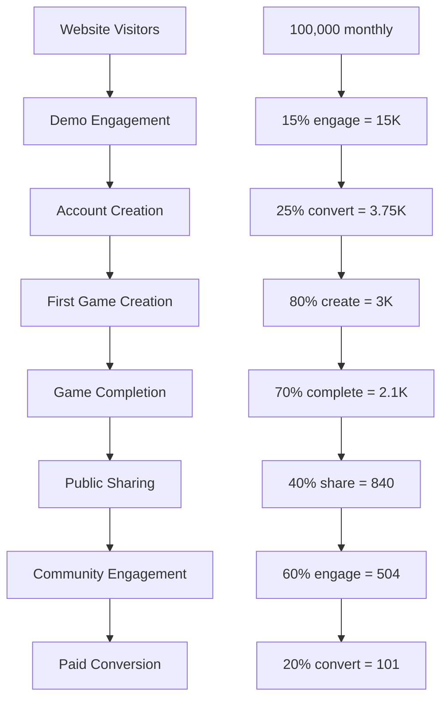
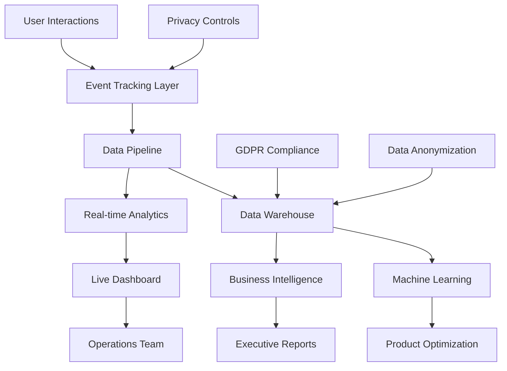
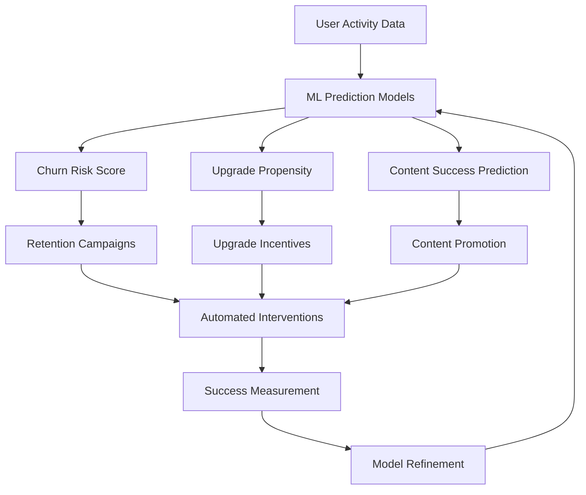

# Success Metrics & Analytics Framework

## Overview

GameGen's success is measured through a comprehensive analytics framework that tracks user engagement, business performance, community health, and educational impact. This data-driven approach ensures product decisions are based on real user behavior and business outcomes.

## Key Performance Indicators (KPIs) Hierarchy

### Primary Business Metrics (North Star Metrics)

#### 1. Monthly Active Users (MAU)
```
Target Growth Trajectory:
Month 3:   1,000 MAU    (Launch milestone)
Month 6:   5,000 MAU    (Product-market fit signal)
Month 12:  25,000 MAU   (Scale milestone)
Month 24:  100,000 MAU  (Growth milestone)

Definition: Users who complete at least one meaningful action 
(create, play, comment, or collaborate) within 30 days.

Success Criteria:
• 15% month-over-month growth rate
• 40% user activation rate (MAU/signups)
• 25% retention rate from month 1 to month 3
```

#### 2. Monthly Recurring Revenue (MRR)
```
Revenue Growth Targets:
Month 6:   $10,000 MRR   (Sustainability indicator)
Month 12:  $75,000 MRR   (Business viability)
Month 18:  $200,000 MRR  (Scale preparation)
Month 24:  $500,000 MRR  (Growth success)

Components:
• Subscription revenue (Pro/Max tiers)
• Credit purchases (pay-per-use)
• Marketplace commissions (30% take rate)
• Enterprise licensing deals
```

#### 3. User-Generated Content Volume
```
Content Creation Goals:
Month 3:   500 games created
Month 6:   5,000 games created
Month 12:  50,000 games created
Month 24:  250,000 games created

Quality Metrics:
• 70% of games reach "playable" state
• 40% of games are shared publicly
• 15% of games receive 10+ plays
• 5% of games achieve "trending" status
```

### Secondary Business Metrics

#### Conversion Funnel


#### Subscription Metrics
```
Free to Pro Conversion:
• Trial to Paid: 25% within 14 days
• Free to Paid: 15% within 90 days
• Churn Rate: <5% monthly for paid users
• Expansion Revenue: 20% Pro to Max upgrade rate

Credit Usage Analytics:
• Average credits per user/month: 25 (Free tier)
• Credit purchase rate: 30% of free users buy credits
• Average credit purchase: $8.50
• Credit utilization rate: 85% of purchased credits used
```

## User Engagement Metrics

### Creation Activity
```
Primary Creation Metrics:
┌─────────────────────────────────────────────────────────┐
│ Daily Creation Activity                                 │
│                                                         │
│ Games Started: Target 500/day                          │
│ Games Completed: Target 350/day (70% completion rate)  │
│ Assets Generated: Target 2,000/day                     │
│ Collaborations: Target 50/day                          │
│                                                         │
│ Success Indicators:                                     │
│ • <5 minutes average time to first game                │
│ • <20 minutes average creation session                 │
│ • 3.2 average games per creator per month              │
│ • 60% of creators return within 7 days                 │
└─────────────────────────────────────────────────────────┘
```

### Session Analytics
```
User Session Patterns:
• Average Session Duration: Target 25 minutes
• Pages per Session: Target 8-12 pages
• Bounce Rate: Target <20% for logged-in users
• Return Visitor Rate: Target 70% within 30 days

Engagement Quality Score:
Scale 0-100 based on:
• Creation activity (40% weight)
• Community participation (30% weight)
• Learning progression (20% weight)
• Platform advocacy (10% weight)
```

### Feature Adoption
```
Feature Usage Dashboard:
┌─────────────────────────────────────────────────────────┐
│ Core Feature Adoption (30-day rolling)                 │
│                                                         │
│ Natural Language Creator: 95% of active users          │
│ Visual Game Editor: 60% of active users               │
│ Asset Generation: 80% of active users                 │
│ Community Features: 45% of active users               │
│ Collaboration Tools: 20% of active users              │
│                                                         │
│ Advanced Features (Pro/Max users):                     │
│ Code Export: 70% of paid users                        │
│ Custom Branding: 40% of paid users                    │
│ API Usage: 15% of Max tier users                      │
│ Team Management: 85% of Max tier users                │
└─────────────────────────────────────────────────────────┘
```

## Community Health Metrics

### Social Engagement
```
Community Vitality Indicators:
┌─────────────────────────────────────────────────────────┐
│ Social Interactions (Monthly)                           │
│                                                         │
│ Game Plays: Target 100K+ plays/month                   │
│ Likes/Reactions: Target 50K+ reactions/month           │
│ Comments: Target 15K+ comments/month                    │
│ Shares: Target 5K+ external shares/month               │
│ Follows: Target 2K+ new follows/month                  │
│                                                         │
│ Content Quality:                                        │
│ • Average Game Rating: Target >4.5 stars               │
│ • Content Report Rate: Target <1% of total content     │
│ • Community Guideline Violations: Target <0.1%         │
│ • User Satisfaction Score: Target >8.5/10              │
└─────────────────────────────────────────────────────────┘
```

### Creator Economy Health
```
Marketplace Metrics:
• Average Template Price: $15
• Creator Revenue Share: 70%
• Monthly Template Sales: Target $10K by month 12
• Active Template Creators: Target 200 by month 12
• Template Quality Rating: Target >4.3 stars average

Creator Success Distribution:
• Top 10% creators generate 60% of content plays
• Middle 40% creators sustain active engagement
• Bottom 50% creators receive growth support
• Creator retention rate: Target 70% month-over-month
```

## Educational Impact Metrics

### Learning Outcomes
```
Educational Success Indicators:
┌─────────────────────────────────────────────────────────┐
│ Learning & Skill Development                            │
│                                                         │
│ Student Accounts: Target 5K by month 12                │
│ Classroom Implementations: Target 100 schools          │
│ Educational Content: Target 20% of total content       │
│ Teacher Training Completions: Target 500 educators     │
│                                                         │
│ Learning Progression:                                   │
│ • Beginner → Intermediate: 40% of students in 3 months │
│ • Intermediate → Advanced: 20% of students in 6 months │
│ • Skill Assessment Pass Rate: Target >85%              │
│ • Creative Thinking Score Improvement: Target +25%     │
└─────────────────────────────────────────────────────────┘
```

### Curriculum Integration
```
Educational Adoption Metrics:
• Subject Integration Rate: 15 different subjects
• Age Group Coverage: K-12 + Higher Education
• International Usage: 25+ countries
• Learning Standard Alignment: 80% of content aligned
• Student Engagement Increase: Target +40% vs traditional methods
```

## Technical Performance Metrics

### Platform Reliability
```
System Performance KPIs:
┌─────────────────────────────────────────────────────────┐
│ Technical Health Dashboard                              │
│                                                         │
│ Uptime: Target 99.9% availability                      │
│ Page Load Speed: Target <3 seconds                     │
│ AI Generation Time: Target <30 seconds average         │
│ Error Rate: Target <0.1% of all requests               │
│ API Response Time: Target <500ms average               │
│                                                         │
│ Scalability Metrics:                                   │
│ • Concurrent Users Supported: 10,000+                  │
│ • Peak Traffic Handling: 5x normal load                │
│ • Database Query Performance: <100ms average           │
│ • CDN Cache Hit Rate: >95%                             │
└─────────────────────────────────────────────────────────┘
```

### AI/ML Performance
```
AI System Metrics:
• Generation Success Rate: Target >95%
• Generation Quality Score: Target >8.0/10 (user rated)
• Asset Relevance Score: Target >85% contextually appropriate
• Model Response Accuracy: Target >90% for natural language
• Credit Efficiency: Target optimization to reduce costs by 20% annually
```

## Analytics Implementation Strategy

### Data Collection Architecture


### Privacy-Compliant Tracking
```
Data Collection Principles:
• Minimal Data: Only collect what's necessary for product improvement
• User Consent: Clear opt-in for all non-essential tracking
• Data Anonymization: Personal identifiers stripped from analytics
• Retention Policies: Automatic deletion of old data
• Transparency: Users can view and delete their data anytime

GDPR Compliance:
• Right to Access: Users can download their data
• Right to Rectification: Users can correct their data
• Right to Erasure: Users can delete their accounts and data
• Right to Portability: Users can export games and assets
• Consent Management: Granular privacy controls
```

### Reporting Dashboard Design
```
Executive Dashboard (Weekly/Monthly):
┌─────────────────────────────────────────────────────────┐
│ 📊 GameGen Executive Dashboard - Week 47, 2024        │
│                                                         │
│ 🎯 Key Metrics vs. Targets:                           │
│ MAU: 23,450 (94% of 25K target) ↗️ +12% WoW           │
│ MRR: $71,200 (95% of $75K target) ↗️ +8% WoW          │
│ Games Created: 2,340 this week ↗️ +15% WoW             │
│ User Satisfaction: 8.7/10 (Target: >8.5) ✅          │
│                                                         │
│ 🚨 Attention Needed:                                  │
│ • Free to Paid conversion down 3% (investigate)        │
│ • Server response time up 12% (optimization needed)    │
│                                                         │
│ 🎉 Wins This Week:                                    │
│ • Record high daily game creations (389 on Tuesday)    │
│ • New educational partnerships signed (3 school districts)│
│ • Community engagement up 20% with new challenge       │
└─────────────────────────────────────────────────────────┘
```

### Product Team Dashboard
```
Product Analytics (Daily/Weekly):
┌─────────────────────────────────────────────────────────┐
│ 🛠️ Product Performance Dashboard                       │
│                                                         │
│ Feature Performance:                                    │
│ • Natural Language Creator: 95% adoption, 4.8★ rating  │
│ • Visual Editor: 60% adoption, 4.6★ rating            │
│ • Asset Generation: 80% adoption, 4.7★ rating         │
│                                                         │
│ User Journey Health:                                    │
│ • Signup → First Game: 80% (↗️ +5% this week)         │
│ • First Game → Completion: 70% (stable)               │
│ • Completion → Share: 40% (↘️ -2% investigate)        │
│                                                         │
│ Experiment Results:                                     │
│ • A/B Test: New Tutorial Flow (+15% completion) ✅ WIN │
│ • Feature Flag: Advanced AI (20% rollout) 📊 monitoring│
│ • Beta Feature: Team Chat (50 users) 📈 positive signals│
└─────────────────────────────────────────────────────────┘
```

## Predictive Analytics & Forecasting

### User Behavior Prediction


### Business Forecasting
```
Revenue Prediction Model:
• 30-day MRR forecast with 85% accuracy
• Seasonal adjustment factors (education calendar)
• New user acquisition cost predictions
• Lifetime value projections by user segment

Growth Scenario Planning:
• Conservative: 10% monthly growth
• Expected: 15% monthly growth  
• Optimistic: 25% monthly growth
• Each with corresponding resource requirements
```

## Success Criteria & Milestone Gates

### Year 1 Success Gates
```
Quarter 1 (Months 1-3):
✅ Achieve Product-Market Fit Signals:
• 1,000+ Monthly Active Users
• 70%+ tutorial completion rate
• 4.5+ average user satisfaction score
• $5K+ Monthly Recurring Revenue

Quarter 2 (Months 4-6):
✅ Establish Community Momentum:
• 5,000+ Monthly Active Users
• 20,000+ user-generated games
• 100+ daily community interactions
• $25K+ Monthly Recurring Revenue

Quarter 3 (Months 7-9):
✅ Prove Business Scalability:
• 15,000+ Monthly Active Users
• Educational pilot programs launched
• Marketplace revenue stream active
• $50K+ Monthly Recurring Revenue

Quarter 4 (Months 10-12):
✅ Demonstrate Growth Sustainability:
• 25,000+ Monthly Active Users
• International user base (25+ countries)
• Enterprise customers acquired
• $75K+ Monthly Recurring Revenue
```

### Long-term Success Vision (Years 2-3)
```
Year 2 Targets:
• 100,000+ Monthly Active Users
• $500K+ Monthly Recurring Revenue
• 1M+ user-generated games
• 50+ enterprise customers
• International expansion (10 languages)

Year 3 Targets:
• 500,000+ Monthly Active Users
• $2M+ Monthly Recurring Revenue
• 10M+ user-generated games
• Market leadership in education segment
• IPO readiness or acquisition interest
```

This comprehensive metrics framework ensures GameGen makes data-driven decisions while maintaining focus on user value, community health, and sustainable business growth.