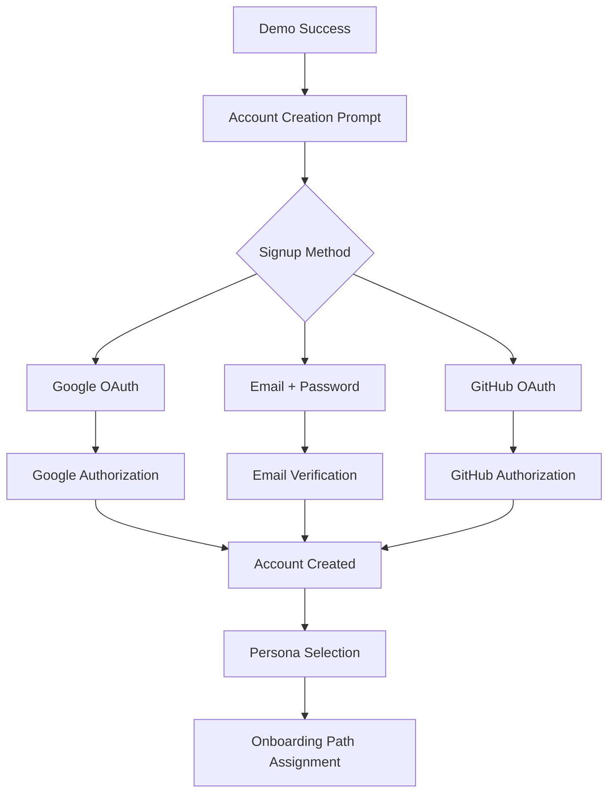
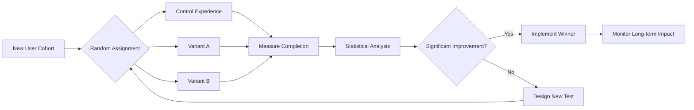
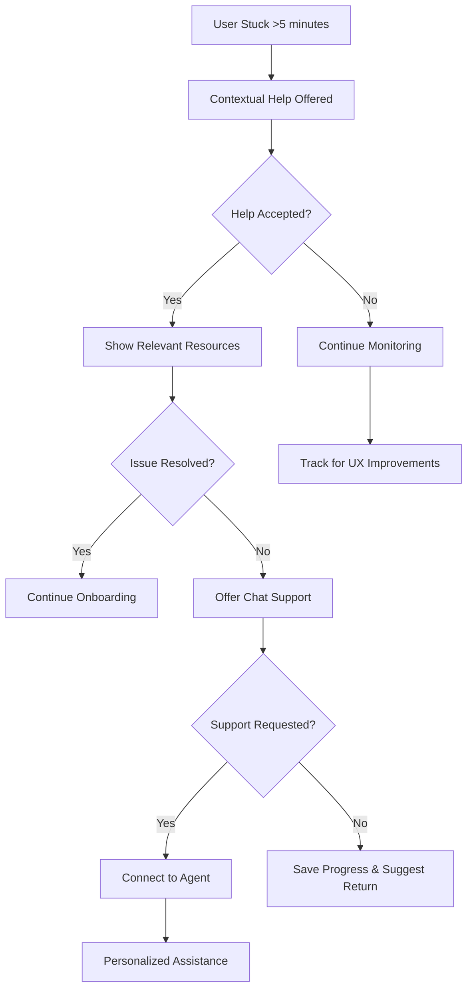

# Onboarding Experience Design: First Impressions to First Success

## Onboarding Philosophy

GameGen's onboarding is designed around the principle of "Learn by Doing." Rather than traditional tutorials that explain features, users immediately create something meaningful while discovering capabilities naturally. The experience is personalized based on user personas and progressively reveals complexity.

## Pre-Registration Experience

### Landing Page Demo
Users can experience GameGen's core value proposition before creating an account.

```
Interactive Demo Section:
┌─────────────────────────────────────────────────────────┐
│ "Try GameGen Right Now - No Signup Required"           │
│                                                         │
│ ┌─────────────────────────────────────────────────────┐ │
│ │ Describe your game idea...                          │ │
│ │ "Make a platformer with a cat collecting fish"     │ │
│ │                                      [Generate] 🎮 │ │
│ └─────────────────────────────────────────────────────┘ │
│                                                         │
│ Or try these popular examples:                          │
│ [🚀 Space Shooter] [🧩 Puzzle Game] [🏫 Math Game]    │
└─────────────────────────────────────────────────────────┘
```

**Experience Flow:**
1. User enters description or selects example
2. AI generates playable game in 20-30 seconds
3. User plays immediately in browser
4. "Magic moment" - realization that they just created a game
5. Gentle prompt to create account to save and continue

**Success Metrics:**
- 60% of visitors engage with demo
- 40% complete demo generation
- 25% create account after demo success

## Account Creation Flow

### Simplified Signup
Minimize friction between interest and engagement.



**Account Creation Form:**
```
┌─────────────────────────────────────────────┐
│ Save Your Game & Continue Creating          │
│                                             │
│ [🌟 Continue with Google]                   │
│                                             │
│ ── or ──                                    │
│                                             │
│ Email: [____________________]               │
│ Password: [____________________]            │
│                                             │
│ [Create Account & Save Game]                │
│                                             │
│ Already have an account? [Sign in]         │
└─────────────────────────────────────────────┘
```

**Key Principles:**
- Emphasize value (saving current work) over features
- Reduce form fields to absolute minimum  
- Social login options prominent
- Clear value proposition for registration

## Persona-Based Onboarding Paths

### Path Selection Interface
After account creation, users choose their primary interest to customize the experience.

```
┌─────────────────────────────────────────────────────────┐
│ Tell us about yourself to customize your experience:     │
│                                                         │
│ ┌─────────────────┐ ┌─────────────────┐ ┌─────────────┐ │
│ │      🎨         │ │      💻         │ │     🎓      │ │
│ │   I'm new to    │ │   I'm an        │ │   I'm an    │ │
│ │  game creation  │ │  experienced    │ │  educator   │ │
│ │   and want to   │ │   developer     │ │   looking   │ │
│ │   learn by      │ │   who needs     │ │    for      │ │
│ │   experimenting │ │  rapid tools    │ │  classroom  │ │
│ │                 │ │                 │ │    tools    │ │
│ │ [Get Started]   │ │ [Show Me Pro]   │ │ [Education] │ │
│ └─────────────────┘ └─────────────────┘ └─────────────┘ │
│                                                         │
│ ┌─────────────────┐ ┌─────────────────┐ ┌─────────────┐ │
│ │      👥         │ │      📱         │ │     ✨      │ │
│ │   I want to     │ │   I create      │ │   Just let  │ │
│ │  collaborate    │ │   content and   │ │   me start  │ │
│ │  with others    │ │   need quick    │ │  creating   │ │
│ │   on projects   │ │   impressive    │ │    right    │ │
│ │                 │ │    results      │ │     away    │ │
│ │ [Collaborate]   │ │ [Content Mode]  │ │ [Skip This] │ │
│ └─────────────────┘ └─────────────────┘ └─────────────┘ │
└─────────────────────────────────────────────────────────┘
```

## Beginner Path: "Creative Beginner"

### Session 1: First Complete Game (15-20 minutes)

#### Step 1: Guided Creation
```
┌─────────────────────────────────────────────────────────┐
│ 👋 Welcome! Let's create your first complete game       │
│                                                         │
│ I'll guide you through making a simple platformer.     │
│ Don't worry - you can't break anything!               │
│                                                         │
│ First, let's describe our hero character:              │
│                                                         │
│ ┌─────────────────────────────────────────────────────┐ │
│ │ "A brave cat who loves collecting shiny coins"     │ │
│ │                                    [Create Hero] 🎨 │ │
│ └─────────────────────────────────────────────────────┘ │
│                                                         │
│ Try it! You can always change it later.               │
└─────────────────────────────────────────────────────────┘
```

#### Step 2: See AI in Action
User watches as AI generates their character sprite with real-time narration:

```
Generation Process Visualization:
┌─────────────────────────────────────────────────────────┐
│ ✨ Creating your cat hero...                           │
│                                                         │
│ ┌──────────┐  →  ┌──────────┐  →  ┌──────────┐        │
│ │[Sketch]  │     │[Colors]  │     │[Details] │        │
│ │          │     │          │     │          │        │
│ └──────────┘     └──────────┘     └──────────┘        │
│                                                         │
│ ▓▓▓▓▓▓▓░░░ 70% • Adding whiskers and tail...          │
│                                                         │
│ 💡 Pro tip: The AI considers your description when     │
│    choosing colors and features!                       │
└─────────────────────────────────────────────────────────┘
```

#### Step 3: Interactive Learning
```
┌─────────────────────────────────────────────────────────┐
│ Perfect! Meet your hero: [Cat Sprite Animation]        │
│                                                         │
│ Now let's add some platforms for jumping. Click        │
│ anywhere on the game area to place a platform:         │
│                                                         │
│ ┌─────────────────────────────────────────────────────┐ │
│ │                                                     │ │
│ │    [Cat Hero]                                       │ │
│ │                                                     │ │
│ │         [Platform] ← You added this!                │ │
│ │                                                     │ │
│ │ [Ground Platform]                                   │ │
│ └─────────────────────────────────────────────────────┘ │
│                                                         │
│ Great! Try clicking [Test] to see your cat jump!       │
└─────────────────────────────────────────────────────────┘
```

#### Step 4: First Success Moment
```
┌─────────────────────────────────────────────────────────┐
│ 🎉 Congratulations! You just made your first game!     │
│                                                         │
│ Your cat can run and jump. Let's add some coins        │
│ to collect for extra fun:                              │
│                                                         │
│ Say: "Add some golden coins to collect"                │
│                                                         │
│ ┌─────────────────────────────────────────────────────┐ │
│ │ Add some golden coins to collect                    │ │
│ │                                    [Add Coins] ✨   │ │
│ └─────────────────────────────────────────────────────┘ │
│                                                         │
│ [◄ Undo] [Test Game ▶] [Share with Friends 🔗]        │
└─────────────────────────────────────────────────────────┘
```

### Session 1 Complete: Achievement & Next Steps
```
┌─────────────────────────────────────────────────────────┐
│ 🏆 Achievement Unlocked: First Game Creator!           │
│                                                         │
│ You've learned:                                         │
│ ✅ How to describe game elements                        │
│ ✅ How AI generates assets for you                      │
│ ✅ How to test and play your game                       │
│ ✅ How to make quick changes                            │
│                                                         │
│ Your game "Cat Coin Collector" has been saved          │
│ to your dashboard.                                      │
│                                                         │
│ What would you like to do next?                        │
│                                                         │
│ [🎮 Play More Games] [🔧 Learn Advanced Tools]         │
│ [👥 Join Community] [📚 More Tutorials]                │
└─────────────────────────────────────────────────────────┘
```

## Developer Path: "Professional Fast-Track"

### Accelerated Onboarding (10-15 minutes)

#### Overview Introduction
```
┌─────────────────────────────────────────────────────────┐
│ Welcome, Developer! 🚀                                 │
│                                                         │
│ I see you're experienced with game development.        │
│ Let me show you GameGen's unique capabilities:         │
│                                                         │
│ • AI-powered rapid prototyping                         │
│ • Consistent art asset generation                      │
│ • Full source code export                              │
│ • Team collaboration tools                             │
│                                                         │
│ Let's create a working prototype in 5 minutes:         │
│                                                         │
│ [Show Me What's Possible] [Skip to Advanced Features]  │
└─────────────────────────────────────────────────────────┘
```

#### Rapid Prototype Creation
```
Advanced Creation Interface:
┌─────────────────────────────────────────────────────────┐
│ Describe your prototype concept:                        │
│                                                         │
│ ┌─────────────────────────────────────────────────────┐ │
│ │ "A bullet hell shooter with procedural enemies      │ │
│ │  and power-up progression system"                   │ │
│ │                                                     │ │
│ │ Advanced Options: [⚙️ Show/Hide]                    │ │
│ │ • Art Style: [Pixel Art ▼]                         │ │  
│ │ • Complexity: [Medium ▼]                           │ │
│ │ • Framework: [HTML5 Canvas ▼]                      │ │
│ └─────────────────────────────────────────────────────┘ │
│                                                         │
│ [Generate Prototype] Credits Required: 5               │
└─────────────────────────────────────────────────────────┘
```

#### Code Export Demo
```
┌─────────────────────────────────────────────────────────┐
│ Your prototype is ready! Here's what GameGen generated: │
│                                                         │
│ ┌─────────────────┐ ┌─────────────────┐               │
│ │   Game Play     │ │  Generated Code │               │
│ │                 │ │                 │               │
│ │ [Playing Game]  │ │ class Player {  │               │
│ │                 │ │   constructor() │               │
│ │                 │ │   update()      │               │
│ │                 │ │   render()      │               │
│ │                 │ │ }               │               │
│ │                 │ │                 │               │
│ │                 │ │ // Documented   │               │
│ │                 │ │ // Modular      │               │
│ └─────────────────┘ └─────────────────┘               │
│                                                         │
│ [▶ Test] [📋 Copy Code] [💾 Export] [🔧 Customize]    │
└─────────────────────────────────────────────────────────┘
```

## Educator Path: "Classroom Ready"

### Education-Focused Onboarding (20-25 minutes)

#### Welcome & Context
```
┌─────────────────────────────────────────────────────────┐
│ Welcome, Educator! 🎓                                  │
│                                                         │
│ GameGen helps teachers integrate game creation into     │
│ curricula without requiring programming knowledge.      │
│                                                         │
│ Let's explore how you can:                             │
│ • Create educational games quickly                      │
│ • Manage student projects                              │
│ • Assess creative work                                 │
│ • Align with learning standards                        │
│                                                         │
│ First, tell us about your teaching context:           │
│                                                         │
│ Grade Level: [Elementary ▼] Subject: [Math ▼]         │
│ Students: [25] Experience: [Beginner ▼]               │
│                                                         │
│ [Customize My Experience]                               │
└─────────────────────────────────────────────────────────┘
```

#### Sample Educational Game Creation
```
┌─────────────────────────────────────────────────────────┐
│ Let's create a math game your students could build:    │
│                                                         │
│ Learning Objective: Practice addition facts 1-10       │
│                                                         │
│ ┌─────────────────────────────────────────────────────┐ │
│ │ "Make a game where students catch falling numbers   │ │
│ │  that add up to 10"                                 │ │
│ │                                  [Create Game] 🎯   │ │
│ └─────────────────────────────────────────────────────┘ │
│                                                         │
│ This demonstrates:                                      │
│ • Subject integration (math)                           │
│ • Age-appropriate gameplay                             │
│ • Clear learning outcomes                              │
│                                                         │
│ 💡 Students will describe games in their own words!   │
└─────────────────────────────────────────────────────────┘
```

#### Classroom Management Preview
```
Teacher Dashboard Preview:
┌─────────────────────────────────────────────────────────┐
│ 👥 Your Virtual Classroom                              │
│                                                         │
│ Current Assignment: "Math Addition Games"              │
│ Due: Friday, Oct 13 • 23/25 students submitted        │
│                                                         │
│ ┌─────────────────────────────────────────────────────┐ │
│ │ Student Progress Overview:                          │ │
│ │                                                     │ │
│ │ ████████████████████░░ 78% Average Completion      │ │
│ │                                                     │ │
│ │ ✅ 18 students • ⏳ 5 in progress • ❌ 2 need help  │ │
│ │                                                     │ │
│ │ [View Individual Progress] [Send Reminders]        │ │
│ └─────────────────────────────────────────────────────┘ │
│                                                         │
│ [Create New Assignment] [Manage Students] [Reports]    │
└─────────────────────────────────────────────────────────┘
```

## Content Creator Path: "Viral Ready"

### Creator-Focused Onboarding (12-15 minutes)

#### Creator Welcome
```
┌─────────────────────────────────────────────────────────┐
│ Hey Creator! 📱✨                                       │
│                                                         │
│ Ready to create games that your audience will love?    │
│ GameGen makes it easy to create shareable, engaging    │
│ content that showcases your creativity.                │
│                                                         │
│ What type of content do you create?                    │
│                                                         │
│ [📺 YouTube] [📱 TikTok] [🎮 Twitch] [📸 Instagram]   │
│ [📝 Blog/Website] [🎓 Educational] [Other]             │
│                                                         │
│ This helps us suggest games that work well for         │
│ your platform and audience!                            │
└─────────────────────────────────────────────────────────┘
```

#### Viral-Optimized Creation
```
┌─────────────────────────────────────────────────────────┐
│ Let's create something shareable! 🚀                   │
│                                                         │
│ Here are some proven game concepts that perform        │
│ well on social media:                                  │
│                                                         │
│ [🧠 "Impossible" Puzzle] [🎯 Skill Challenge]          │
│ [🏆 High Score Chase] [😂 Funny Physics]               │
│                                                         │
│ Or describe your own viral game idea:                  │
│                                                         │
│ ┌─────────────────────────────────────────────────────┐ │
│ │ "A game where you have to keep a cat from          │ │
│ │  knocking things off a table"                      │ │
│ │                                [Create Game] 😺     │ │
│ └─────────────────────────────────────────────────────┘ │
│                                                         │
│ 💡 GameGen automatically optimizes for mobile play!   │
└─────────────────────────────────────────────────────────┘
```

## Progressive Skill Development

### Week 1: Foundation Building

```mermaid
gantt
    title First Week Learning Journey
    dateFormat  X
    axisFormat %d

    section Day 1
    Complete First Game    :done, d1, 0, 1
    Explore Community     :done, d1b, 0, 1
    
    section Day 2-3
    Try Different Genres   :active, d2, 1, 2
    Use Asset Library     :active, d2b, 1, 2
    
    section Day 4-5
    Learn Visual Editor    :d3, 2, 2
    Share First Game      :d3b, 2, 2
    
    section Day 6-7
    Remix Others' Games    :d4, 4, 2
    Join Community Forum  :d4b, 4, 2
```


### Skill Progression System
Users unlock new capabilities based on their engagement and success:

```
Skill Tree Progression:
┌─────────────────────────────────────────────────────────┐
│ 🌟 Your GameGen Journey                                │
│                                                         │
│ Beginner Creator [████████████████████] Complete ✅    │
│ • First game created                                    │
│ • Used AI asset generation                             │
│ • Shared game publicly                                 │
│                                                         │
│ Intermediate Creator [██████████░░░░░░░░] 60%          │
│ • Use visual editor (unlocked)                         │
│ • Try 3 different genres (2/3)                        │
│ • Receive 10 likes on games (4/10)                    │
│                                                         │
│ Advanced Creator [░░░░░░░░░░░░░░░░░░░░] Locked          │
│ • Create complex game mechanics                        │
│ • Collaborate with other users                         │
│ • Mentor new community members                         │
│                                                         │
│ Next Milestone: Try making a puzzle game! 🧩          │
│ [Browse Puzzle Templates]                              │
└─────────────────────────────────────────────────────────┘
```

## Onboarding Analytics & Optimization

### Key Success Metrics

#### Completion Rates
```
Onboarding Funnel Goals:
• Account Creation → First Game: 80%
• First Game → Game Completion: 70% 
• Game Completion → Public Share: 40%
• Public Share → Return Next Day: 50%
• Return Next Day → Week 1 Retention: 60%
```

#### Persona-Specific Metrics
```
Beginner Path:
• Tutorial completion: >85%
• Time to first game: <20 minutes
• Feature discovery rate: >60%

Developer Path:
• Code export usage: >70%
• Advanced feature adoption: >50%
• API documentation viewed: >30%

Educator Path:
• Classroom setup completion: >90%
• Student management usage: >80%
• Assignment creation: >70%
```

### A/B Testing Framework

#### Continuous Optimization


#### Testing Areas
- Tutorial length and complexity
- AI generation wait times and messaging
- Feature introduction order
- Success celebration timing and style
- Path selection methodology

## Accessibility in Onboarding

### Universal Design Principles

#### Screen Reader Support
```
Accessible Tutorial Flow:
┌─────────────────────────────────────────────────────────┐
│ <h1>Welcome to GameGen</h1>                           │
│ <p>Step 1 of 5: Create your first character</p>       │
│                                                         │
│ <label for="character-description">                    │
│   Describe your character:                             │
│ </label>                                               │
│ <textarea id="character-description"                   │
│          aria-describedby="char-help"                  │
│          placeholder="A brave hero who...">           │
│                                                         │
│ <div id="char-help" class="sr-only">                  │
│   Describe appearance and personality in 1-2 sentences │
│ </div>                                                  │
│                                                         │
│ <button type="submit" aria-live="polite">              │
│   Generate Character                                    │
│ </button>                                               │
└─────────────────────────────────────────────────────────┘
```

#### Keyboard Navigation
- Clear focus indicators throughout tutorial
- Skip links for repetitive content
- Logical tab order that follows visual flow
- Escape key to exit any modal or overlay

#### Cognitive Accessibility
- One concept introduced per screen
- Clear progress indicators
- Ability to repeat demonstrations
- Multiple learning modalities (visual, audio, text)

## Onboarding Support System

### Contextual Help
```
Smart Help System:
┌─────────────────────────────────────────────────────────┐
│ 💡 Need help? I noticed you've been on this step       │
│    for 2 minutes.                                       │
│                                                         │
│ Common questions at this stage:                        │
│ • "What makes a good character description?"           │
│ • "Can I change this later?"                          │
│ • "How detailed should I be?"                         │
│                                                         │
│ [Get Detailed Help] [See Examples] [Ask Community]    │
│ [Continue Alone] [Start Over]                         │
└─────────────────────────────────────────────────────────┘
```

### Human Support Escalation


This comprehensive onboarding experience design ensures that users of all skill levels and backgrounds can successfully discover GameGen's value and begin their creative journey with confidence and excitement.