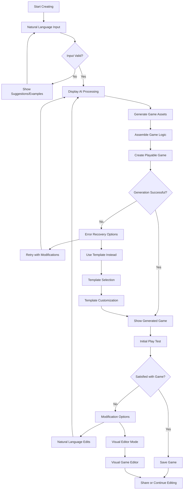
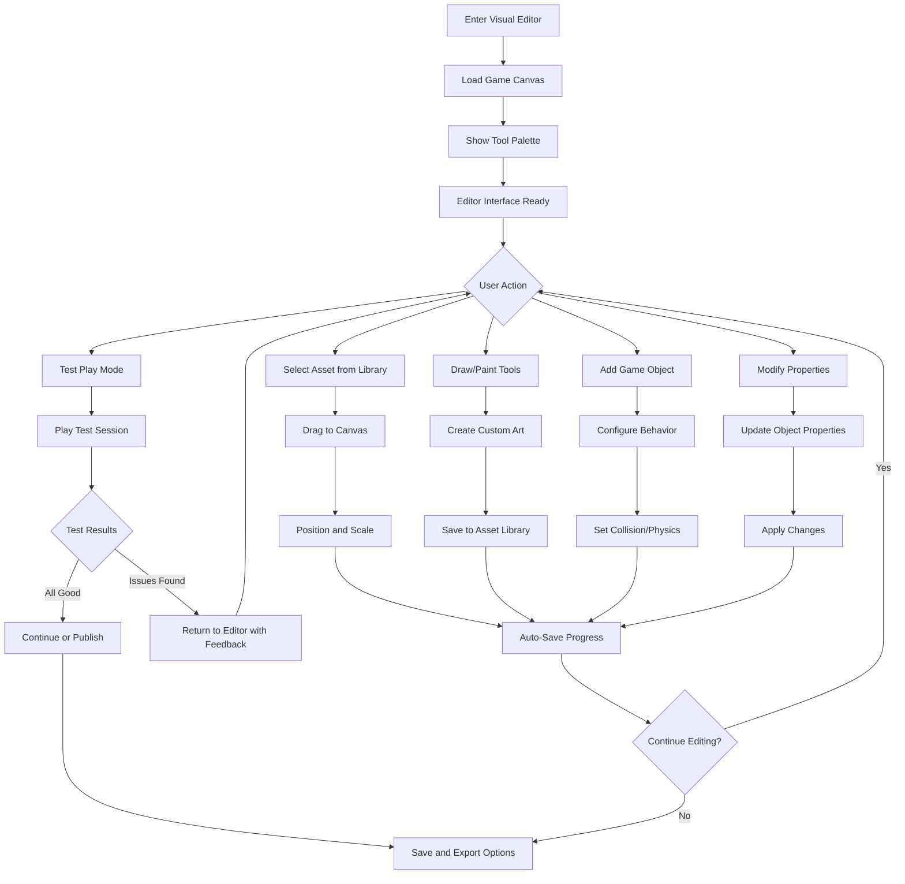
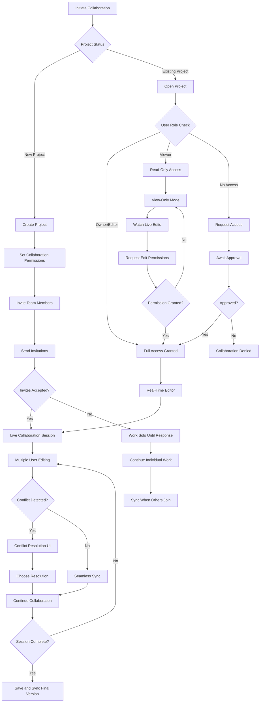
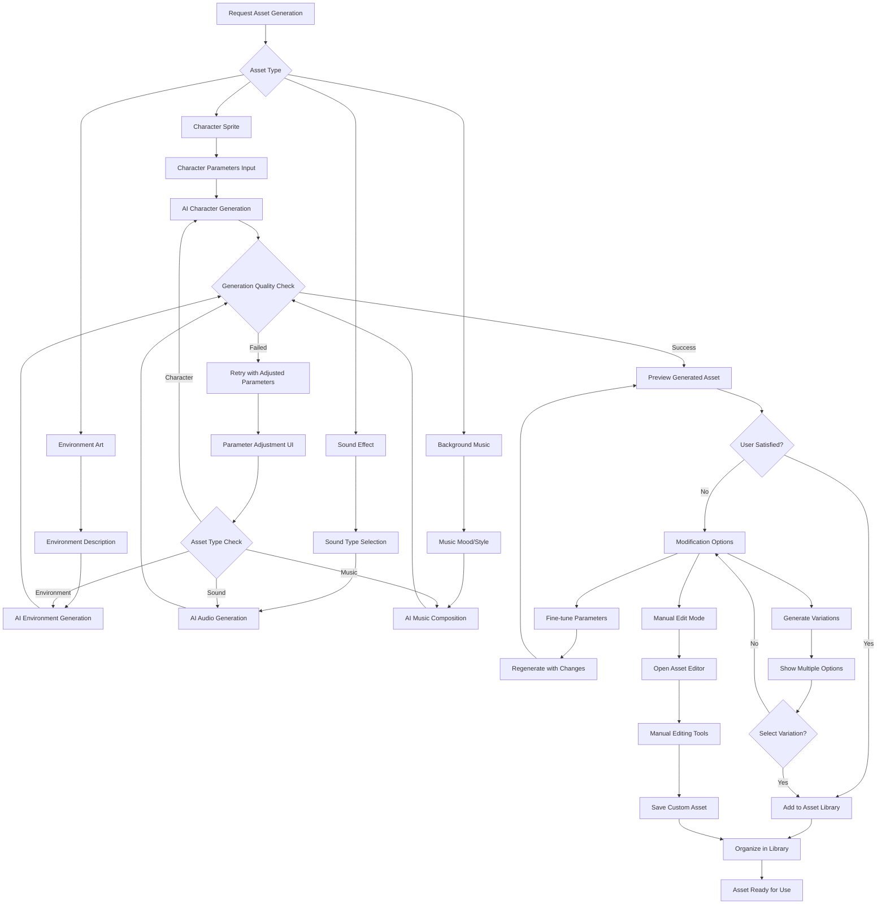
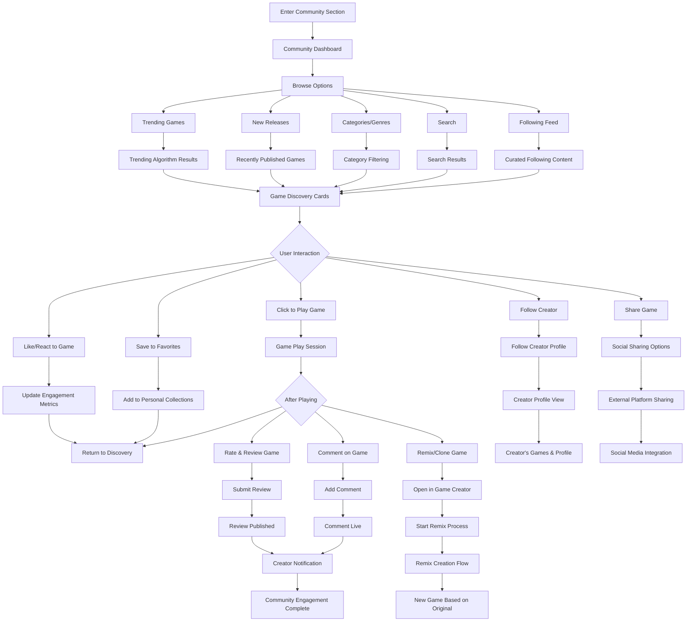
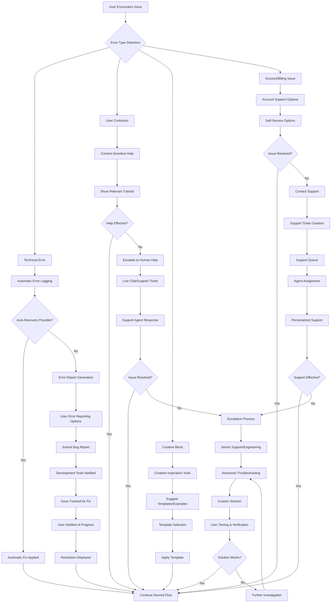
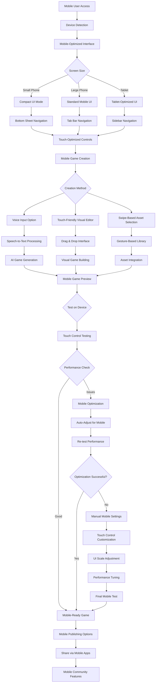
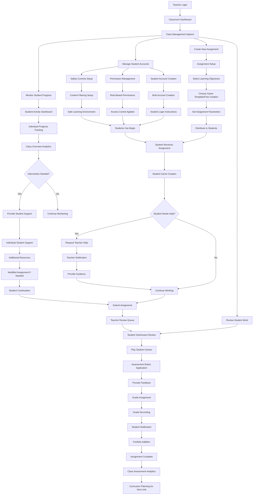

# UX Flow Diagrams: GameGen User Experience Flows

## 1. New User Onboarding Flow

```mermaid
flowchart TD
    A[Land on GameGen.com] --> B{First Time Visitor?}
    B -->|Yes| C[Show Hero Demo]
    B -->|No| D[Show Personalized Dashboard]
    
    C --> E[Interactive "Try Now" Demo]
    E --> F{Demo Successful?}
    F -->|Yes| G[Magic Moment: "You just made a game!"]
    F -->|No| H[Simplified Demo with Help]
    
    G --> I{Account Created?}
    H --> I
    I -->|No| J[Encourage Signup: "Save Your Game"]
    I -->|Yes| K[Welcome Tutorial]
    
    J --> L[Quick Signup Form]
    L --> M[Email Verification]
    M --> K
    
    K --> N[Choose Your Path]
    N --> O[Beginner: Guided Tutorial]
    N --> P[Experienced: Advanced Features]
    N --> Q[Educator: Classroom Setup]
    
    O --> R[Complete First Full Game]
    P --> S[Explore Professional Tools]
    Q --> T[Set Up Student Accounts]
    
    R --> U[Share Your Creation]
    S --> U
    T --> V[Teacher Dashboard]
    
    U --> W[Discover Community]
    V --> W
    W --> X[Onboarding Complete]
```

## 2. Game Creation Flow - Natural Language



## 3. Visual Game Editor Flow



## 4. Collaborative Creation Flow



## 5. Asset Generation & Management Flow



## 6. Publishing & Sharing Flow

```mermaid
flowchart TD
    A[Complete Game Creation] --> B[Publishing Options]
    B --> C[GameGen Platform]
    B --> D[External Export]
    B --> E[Share with Specific Users]
    
    C --> F[Platform Publishing Setup]
    D --> G[Export Format Selection]
    E --> H[User Selection Interface]
    
    F --> I[Add Game Metadata]
    G --> J{Export Type}
    H --> K[Set Sharing Permissions]
    
    I --> L[Game Title & Description]
    J --> M[Web Export (HTML5)]
    J --> N[Desktop Export]
    J --> O[Mobile Export]
    J --> P[Source Code Export]
    
    L --> Q[Category & Tags]
    M --> R[Web Optimization]
    N --> S[Platform-Specific Builds]
    O --> T[Mobile Optimization]
    P --> U[Code Documentation Generation]
    
    Q --> V[Privacy Settings]
    R --> W[Build Process]
    S --> W
    T --> W
    U --> X[Source Package Creation]
    
    V --> Y[Content Rating]
    W --> Z{Build Successful?}
    X --> AA[Download Ready]
    
    Y --> BB[Review & Publish]
    Z -->|Yes| CC[Download/Deploy Ready]
    Z -->|No| DD[Build Error Resolution]
    
    BB --> EE{Publish Successful?}
    CC --> FF[Share Download Link]  
    DD --> GG[Fix Issues & Retry]
    
    EE -->|Yes| HH[Game Live on Platform]
    EE -->|No| II[Publishing Error Handling]
    FF --> JJ[Distribution Complete]
    GG --> W
    
    HH --> KK[Analytics & Community Features Active]
    II --> LL[Resolve Publishing Issues]
    JJ --> MM[Track Download Metrics]
    
    K --> NN[Send Share Notifications]
    LL --> BB
    MM --> OO[Export Complete]
    NN --> PP[Shared Access Granted]
    KK --> QQ[Publishing Complete]
```

## 7. Community Discovery & Interaction Flow



## 8. Error Recovery & Help Flow



## 9. Mobile-Responsive Interaction Flow



## 10. Educational Workflow - Classroom Management



These UX flows provide comprehensive guidance for implementing GameGen's user experience, ensuring smooth interactions across all major features and user scenarios. Each flow accounts for error states, mobile considerations, and different user personas while maintaining consistency in design patterns and user expectations.